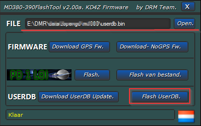

# dstar380

Append contacts from dstar.su database and TG list to TYT MD380/390 userdb.bin (c) 2020, EU1ADI

Программа для импорта контактов из dstar.su в базу контактов userdb.bin радиостанций TYT MD380/390 (однодиапазонные)

В базу контактов https://raw.githubusercontent.com/DMR-Database/database/master/user.bin добавятся контакты из dstar.su и информация о TG группах. Все данные скачиваются автоматически. На выходе получится файл userdb.bin, который можно закачать в радиостанцию при помощи утилиты TyteraFlashTool.

## Использование

- Запустите `userdb.exe`

- Скопируйте userdb.bin в папку с утилитой TyteraFlashTool или укажите путь к файлу

- Залейте userdb.bin в радиостанцию

## Параметры запуска 

`userdb.exe -exclude 310,311,312`

Исключить контакты начинающиеся на перечисленные префиксы 310,311,312. Может быть полезно для уменьшения выходого файла.

`userdb.exe -skip-tg`

Не импортировать информацию о TG группах.

`userdb.zip` скомпилировная версия для Win10 x64
`userdb.x86.zip` скомпилировная версия для x86

## Поддержка

Вопросы можно задать в чате https://t.me/qsyby
